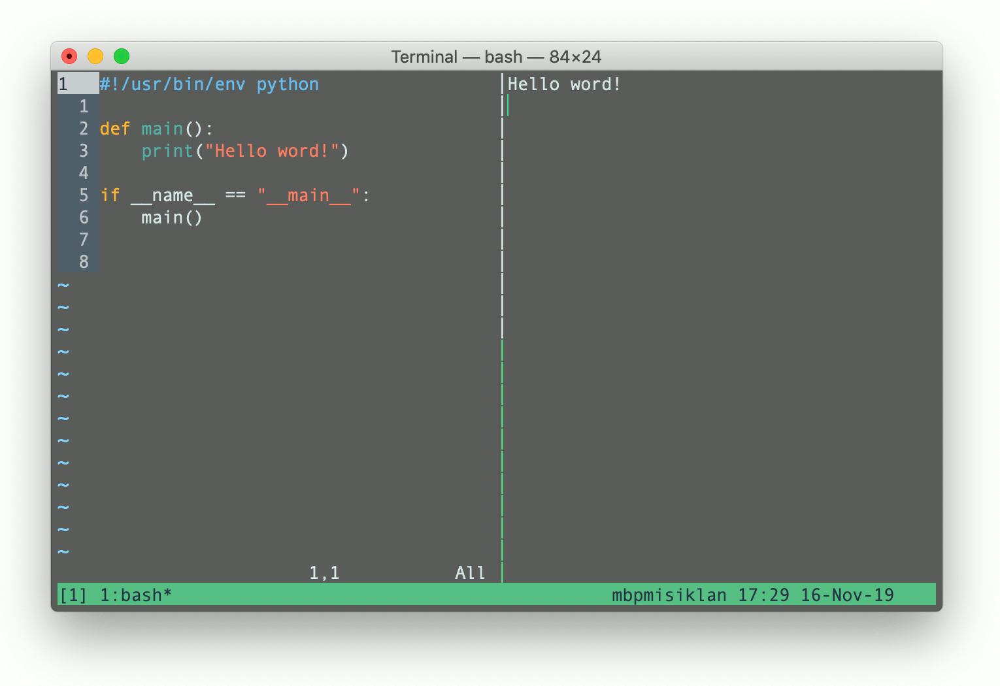

# Simple Vim-based IDE with tmux
- published: 2018-09-30T10:00:00+0000
- tags: vim, tmux, bash, programming

In my profession, I sometimes need to create or modify short python scripts,
which are usually used to process or generate texts (code). To edit python (or
any other) scripts and having live-preview of the output along the editor, one
can use combination of `vim` (or any other command line text editor) and `tmux`.

After opening a new *tmux session*, it is possible to open editor with the
script to be modified by entering something like:

```bash
vim test.py
```

The vertical split screen is in `tmux` opened by pressing *tmux prefix* key
combination (`ctrl + b` by default) and `%` key. In the end the result could
look something like following figure:



Switching between tmux panes (splits) is done by pressing *tmux prefix* key
combination followed by an arrow key. The live-preview in the right-side pane
can be achieved using following `bash` commands:

```bash
while true ; do python test.py ; sleep 1 && clear ; done
```

Notice the semicolon between python invocation command and `sleep` command, this
is used intentionally (instead something like `&&`) to prevent from looping very
rapidly trough just first statement in case of error, since bash evaluates
logical expression in short-circuited fashion.

After finishing the editing session the live-preview can be terminated by
switching into its pane and pressing `ctrl + c`.
